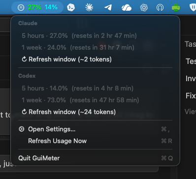

<p align="center">
  
</p>

<h1 align="center">AIGauge</h1>

<p align="center">
  <em>How much of my Claude and Codex did I burn this hour?</em><br>
  A tiny menu-bar gauge + two CLIs for the over-curious.
</p>

<p align="center">
  
  
  
</p>

## Why

I pay for both Claude Pro and ChatGPT Plus. I also have ADHD about quota windows. Manually opening claude.ai → Settings → Usage and then chatgpt.com/codex to see if I'd hit the 5-hour wall got old, so I built one menu-bar dot that tells me both at a glance.

Bonus trick: each tool also has a `refresh` action that fires a 2–24 token "ping" to *start* the 5-hour window early, so you don't lose 2 hours of quota every time you sit down to actually work.

## Usage

### GUI

<p align="center">
  
</p>

Click the tray gauge → menu shows both services with their 5-hour and 1-week numbers and a one-click `Refresh window` button.

In **Settings → General** you choose:

- which provider's percent shows on the tray (Claude / Codex / **Both** / None) — colored numbers so you can tell them apart at a glance,
- which providers get a section in the dropdown menu,
- auto-refresh interval, launch-at-login, etc.

### CLI

Both CLIs share the same surface:

```bash
ClaudeGauge usage           # 5-hour: 8.0%  (resets in 4 hr 12 min) ...
ClaudeGauge usage --json    # pipe me into jq
ClaudeGauge refresh         # ~2 tokens — primes the 5h window

CodexGauge  usage           # Plan: plus · primary 1.0% · secondary 70.0%
CodexGauge  refresh         # ~24 tokens
```

Exit codes: `0` ok · `2` bad args · `3` missing credentials · `4` API error.

Drop them into `cron` / `launchd` / your fav scheduler. See [FULL_README.md](FULL_README.md) for the openclaw patterns and every flag.

## First run — what those popups are

macOS will throw one or two **Keychain access prompts** the first time AIGauge looks up your credentials. They look scary; they're not. Here's the cheat sheet:

| Prompt | What it really means | Safe to allow? |
|---|---|---|
| `"ClaudeGauge" wants to use "Claude Safe Storage" in your keychain` | Claude Desktop encrypts its session cookie with a key stored here. We read the key once to decrypt the cookie, then call claude.ai. | **Yes — click "Always Allow".** |
| `"CodexGauge" wants to access key "Codex Auth"` | Only shown if `~/.codex/auth.json` is missing. The Codex desktop app stored your ChatGPT OAuth token in the keychain — we read it to call `/wham/usage`. | **Yes — click "Always Allow".** |
| `"…" wants to use "Chrome/Brave Safe Storage"` | Same as the Claude one, but only fires if you're logged into Claude in a browser instead of the desktop app. | **Yes — "Always Allow".** |
| macOS asks for **Full Disk Access** | Only triggers if reading browser cookie DBs. Toggle on in System Settings → Privacy → Full Disk Access. | **Yes** — or skip it and stay logged into Claude Desktop instead. |

> [!IMPORTANT]
> **Click the "Always Allow" button**, not just "Allow". "Allow" is one-shot — you'd see the same dialog every 60 seconds when the GUI refreshes. "Always Allow" persists the permission.

After the first successful extraction, the credentials are cached in `~/.config/claude-gauge/settings.json` so even *that* one prompt only happens once per install (or until you run `reset.sh`). Subsequent refreshes don't touch the keychain at all.

What AIGauge actually does with those credentials:

- **Read-only.** Tokens and cookies are pulled, never written, never re-stored.
- **Two hosts, period.** Outgoing HTTPS only goes to `claude.ai` and `chatgpt.com` — the same servers your browser already talks to.
- **No telemetry, no analytics, no phone-home.** The full source is in this repo; `grep` it.
- **Stays on disk in two boring places:** `~/.config/claude-gauge/` and `~/.config/codex-gauge/` (logs + your settings.json). Nuke them anytime with [`aigauge/reset.sh`](aigauge/reset.sh).

If you ever want to start over and watch the first-run flow again:

```bash
cd aigauge && ./reset.sh   # wipes our cache, leaves your real logins alone
open release/AIGauge.app
```

## Build

```bash
cd aigauge
./build.sh        # builds CLI + GUI, assembles AIGauge.app, ad-hoc signs
./make-dmg.sh     # styled drag-to-Applications installer DMG
open release/AIGauge.dmg
```

Requires **macOS 13+** and Swift 5.9 (Xcode CLT or swift.org toolchain). Everything else is built-in: no Homebrew, no npm, no `create-dmg`.

Want just one CLI? `cd claude-gauge && ./run.sh` or `cd codex-gauge && ./run.sh`.

## License & credits

MIT.

- `claude/` is a CLI-only fork of [Decryptu/claude-gauge](https://github.com/Decryptu/claude-gauge) (MIT). All the cookie-decrypt cleverness is theirs.
- `codex/` was reverse-engineered fresh against `/backend-api/wham/usage` and the public Codex CLI source.
- `aigauge/` ties them together in a tiny Swift/SwiftUI menu-bar wrapper.

## About

Built by VUBA (dev@vuba.one) — [vuba.one](https://vuba.one). No telemetry, only calls claude.ai and chatgpt.com.

Full docs · openclaw automation patterns · endpoint catalog · file layout → [FULL_README.md](FULL_README.md)
